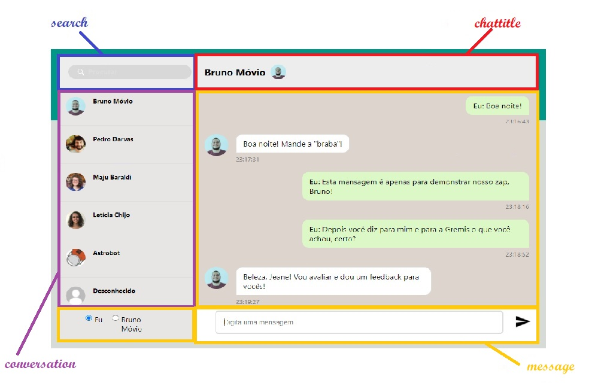

<h2 align="center">WhatsLab</h2>


<h3 align="center">
  
</h3>
<hr/>


## ⚙️ Tecnologias Usadas:
- CSS3
- JavaScript 
- React Js 
- React Components
- Styled Components

## ⚙️ Estrutura do Projeto

- Arquivo `.gitignore`
- Arquivo `package.json`
- Arquivo `package-lock.json`
- Pasta `node_modules`: Armazena os pacotes das dependências que definimos no arquivo package.json. Também deve ser observado que este diretório é definido dentro de .gitignore para que todas as dependências infinitas não sejam carregadas para o repositório Git. Portanto, quem baixar o projeto instalará as dependências [diretamente da web](https://www.npmjs.com/
)
- Pasta `public`: Ele contém os arquivos estáticos que nos permitirão montar o aplicativo.
- Pasta `src` (source): A pasta src é a pasta onde nosso código React está localizado.
## ⚙️ Explicação da Estrutura
Este desafio consiste em construir uma pequena aplicação, fizemos inspiradas no WhatsApp, por isso optamos por uma interface que nos remetesse ao aplicativo em questão.

Contém uma lista de usuários que simulam um contato do WhatsApp e conterão a imagem do perfil e o nome de cada usuário.

O aplicativo também fornece um filtro de busca, que seleciona os membros por nome.

Para demonstrar a funcionalidade do aplicativo, adicionamos uma região que permite simular a troca de 
mensagens entre duas pessoas, no caso o usuário e um dos contatos presentes na lista.


## ⚙️ Pasta src ou Source:

- Arquivo Index.js:
Se abrirmos o arquivo index.js. Vamos analisar o conteúdo do arquivo:

*Linha 1:* importa o módulo React que, como vimos, está  dentro do arquivo package.json e nos permitirá criar interfaces.

*Linha 2:* importa o módulo React-dom que, como vimos, também está dentro do arquivo package.json e nos permitirá criar interfaces para o navegador / web.

*Linha 3:* temos a importação do arquivo index.css.

*Linha 4:* temos a importação para App que está chamando o arquivo App.js no diretório src.

*Linha 6:* é aquela usada pelo React, que adiciona o código que falta ao documento HTML (a imagem, o parágrafo e o link). O que ReactDOM.render realmente faz (que eu quero pintar, onde eu quero pintá-lo) é adicionar um componente dentro do elemento do elemento com id "root" de index.html usando a instrução JavaScript document.getElementById ("root") .

- Arquivo App.js:
O arquivo do App, cuja componente é pai de todos, onde importamos o React, o encarregado de desenhar as interfaces.
O esqueleto do componente é um componente funcional (chamado App). Dentro dele temos a importação do arquivo ChatContainer que está chamando o arquivo ChatContainer.js no diretório pages do src.

- Pasta components/container:
Pasta filho do componente App.js. A componente container será pai dos componentes chattile, message, conversation e search.

- Pasta components / Arquivo chattitle:
Exibe o nome e foto do contato com o qual o usuário está conversando.
- Pasta components / Arquivo search:
Permite efetuar a busca na lista de contatos através do nome.
- Pasta components / Arquivo conversation:
Exibe nome e foto dos membros da lista de contato.
- Pasta components / Arquivo message:
Componente responsável pela troca de mensagens. Abrange três áreas do aplicativo: a área onde selecionamos quem irá enviar a mensagem (apenas para demonstrar a funcionalidade do aplicativo), a área onde digitamos e enviamos a mensagem e a área onde as mensagens trocadas são exibidas.

-As componetes descritas acima estão indicadas na figura a seguir:


- Pasta images:
Contém as imagens dos contatos do usuário.


##  Instalação


## 🏁 Para rodar o projeto:

Clone este repositório em sua máquina:

```bash
$ git clone https://github.com/future4code/mu-oz-whatslab1.git
```

cd `mu-oz-whatslab1` e rode:

```bash
npm install
```

para iniciar:

```bash
npm run start
```

<br/>

##  Conclusão


P.D. Um protótipo deste aplicativo (MVP - Produto Mínimo Viável) pode ser visto no seguinte endereço:


Atenciosamente,

Gremis Tovar e Jeane Melo